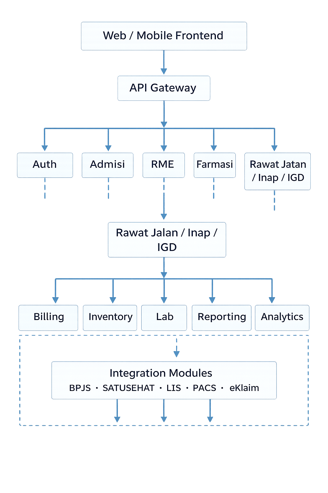

# Adameds (CLINIC INFORMATION SYSTEM)

## Requirement
- Docker v26.0.0 atau lebih baru
- Ram minimal 4GB
- CPU minimal core i3
- Penyimpanan minimal 100GB

## INSTALLASI
- clone repository
``` sh
git clone --recurse-submodules https://github.com/adamlabs39/adameds.git
```
- sebelum itu sesuaikan `.env` nya terlebih dahulu
- install menggunakan docker
``` sh
docker compose up --build -d
```


## 🏥 ADAMEDS Community
> The Next-Generation Open Healthcare Platform for Indonesia

ADAMEDS adalah platform **Sistem Informasi Klinik & Rumah Sakit** berbasis komunitas  
yang dirancang untuk tumbuh bersama fasilitas kesehatan — dari klinik kecil  
hingga jaringan rumah sakit besar.

---


## 🚀 Why ADAMEDS?
---
| ADAMEDS               | Legacy SIMRS |
| --------------------- | --------- |
| Modular & scalable |  Monolithic |
| Cloud & on-prem ready | On-prem heavy |
| Enterprise compliance ready | Manual compliance |
| AI-ready foundation | Not future-ready |
| Community + Enterprise ecosystem | Single mode|

---

## 🧩 Architecture Overview

<p align="center">
  
</p>

## ⚡ Quick Start (15 Minutes Setup)

## Hardware Requirements
* Memory/RAM ≥ 8GB
* Storage ≥ 100GB
* Core ≥ 32 CORE

## System Requirements
* OS Debian ≥ 12
* Docker & Docker Compose
* Git

### Installation

```bash
git clone --recurse-submodules https://github.com/wahanameditek/adameds-community.git
cd adameds
cp .env.example .env
bash installer.sh
````

Buka browser:

```
http://localhost:8080
```

Login awal:

```
username: admin
password: admin123
```

---

## 🧬 Core Modules

* Admisi & Antrian
* Rawat Jalan / Rawat Inap / IGD
* Farmasi & Inventory
* Laboratorium
* Billing & Pembayaran
* Rekam Medis Elektronik
* Reporting & Dashboard

---

## 🧬 Community vs Enterprise

| Feature               | Community | Enterprise |
| --------------------- | --------- | ---------- |
| Core clinical modules | ✅         | ✅          |
| BPJS integration      | ❌         | ✅          |
| SATUSEHAT integration | ❌         | ✅          |
| LIS & PACS            | ❌         | ✅          |
| Advanced analytics    | ❌         | ✅          |
| 24/7 SLA support      | ❌         | ✅          |

---

## 📚 Full Documentation

Untuk panduan lengkap mulai dari **Getting Started**, **Instalasi**,
hingga **Customisasi & Deployment Production**, silakan kunjungi:

👉 **[https://community.adameds.id/docs](https://community.adameds.id/docs)**

---

## 🌱 Join the Community

* 💬 Telegram: [https://t.me/adameds-community](https://t.me/adameds-community)
* 💻 GitHub Discussions
* 🧪 Monthly Community Meetup

---

## 🤝 Partner Program

Kami membuka kemitraan nasional untuk:

* Implementator daerah
* Konsultan rumah sakit
* Startup HealthTech

📩 [partnerships@adameds.id](mailto:partnerships@adameds.id)

---

## 🗺️ Roadmap

### 2026

* BPJS & SATUSEHAT Integration
* Multi-branch hospital system
* Advanced analytics dashboard

### 2027

* AI clinical assistant
* National healthcare data network
* Interoperability platform

---

## 🛡️ License

ADAMEDS Community is released under **GPL v3**.
Enterprise modules are proprietary.

---

## ⭐ Vision

> **Building the Healthcare Operating System for Indonesia.**

```